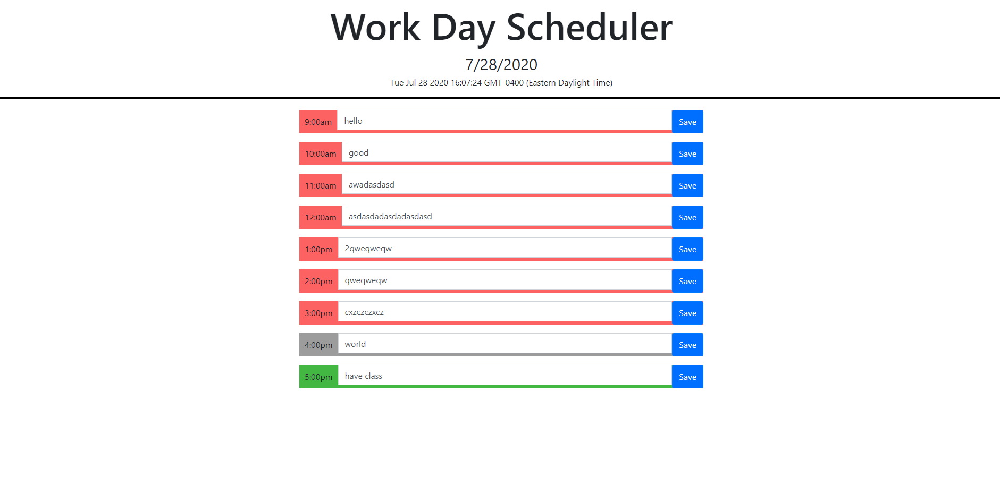

# online-planner

This program is a daily todo list that wil let the user input their plans for every hour of the day and save it.

If the time is late then the background-color is red

If it is current hour then it is grey

If the current time is before your planned time then it will be green

When you save anything you write in the text area it will still display in the textbox

